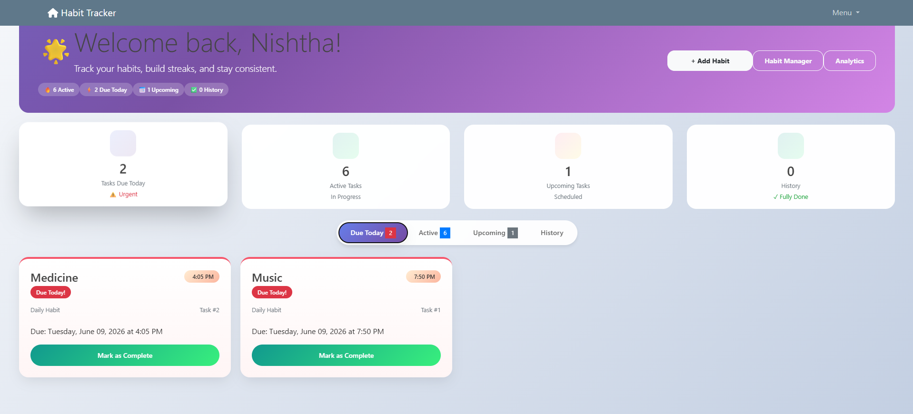
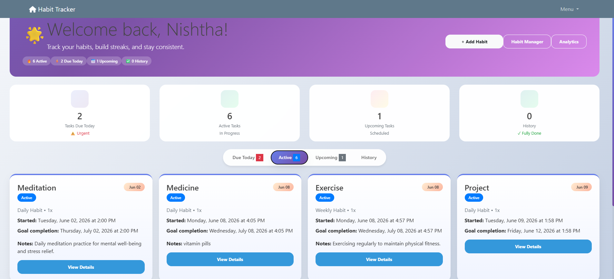
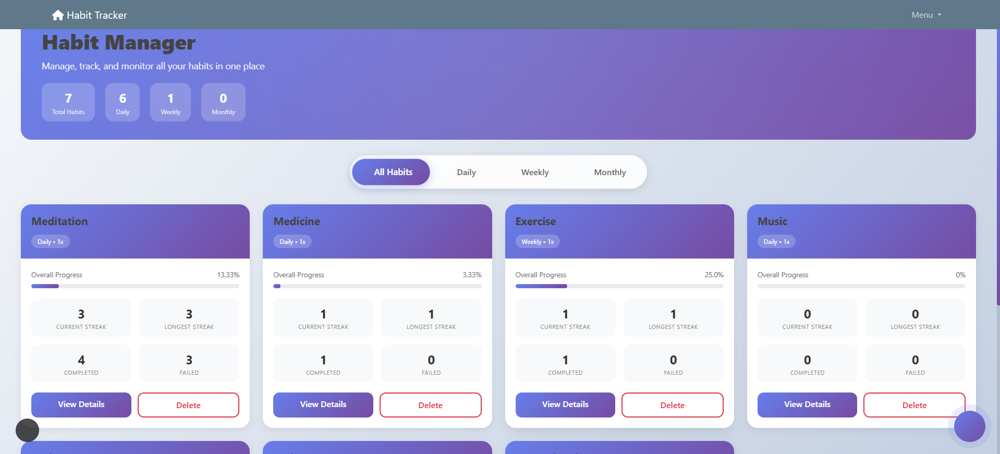
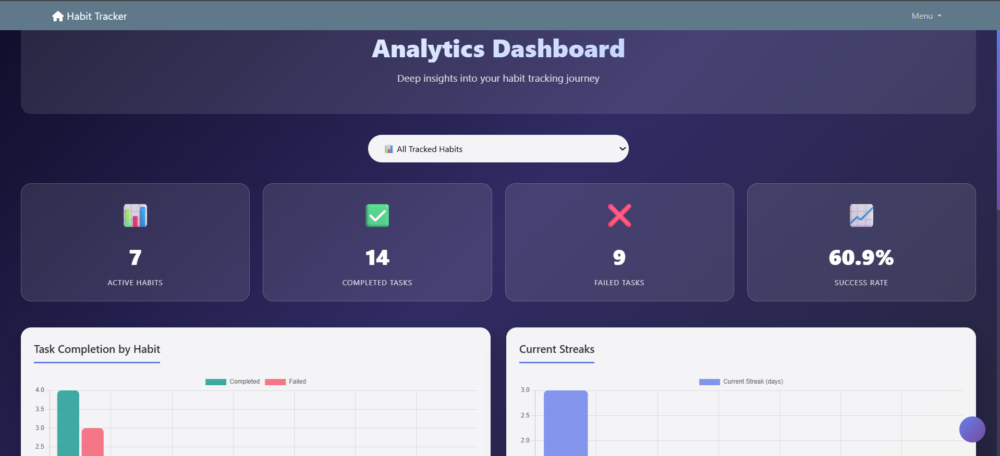
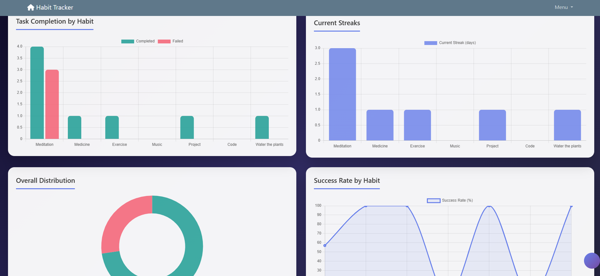
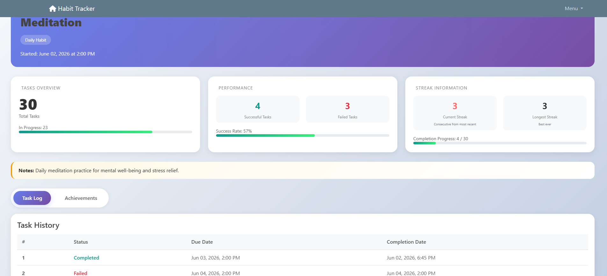
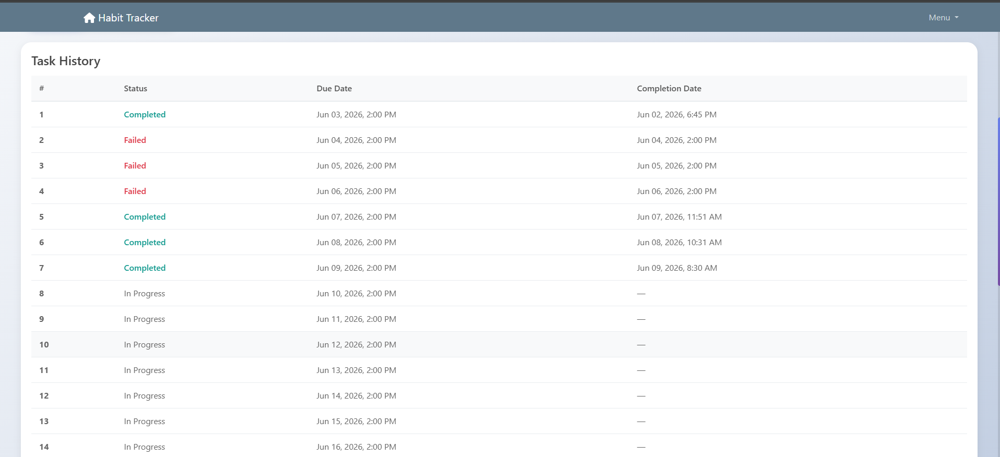

# Django Habit Tracker

A modern habit tracking web application built using Django that helps users build consistency, track progress, maintain streaks, and analyze habit performance through an interactive dashboard.

## Features

### User Authentication

* Secure user registration and login system
* Personalized user profiles
* Individual habit tracking for each user

### Habit Management

* Create daily, weekly, and monthly habits
* Set habit goals and frequencies
* Add notes and descriptions
* View all active habits in a dedicated Habit Manager
* Delete habits when no longer needed

### Task Tracking

* Automatic task generation based on habit duration and frequency
* Due Today section for urgent tasks
* Active Habits section for ongoing habits
* Upcoming Habits section for habits scheduled in the future
* One-click task completion

### Streak Tracking

* Current streak calculation
* Longest streak tracking
* Habit consistency monitoring
* Achievement tracking

### Analytics Dashboard

* Habit performance insights
* Progress visualization
* Streak analysis
* Task completion statistics
* Productivity monitoring

### History Tracking

* Completed task history
* Habit completion records
* Progress review over time

### User Interface

* Modern Bootstrap-based design
* Responsive layout
* Interactive dashboard
* Clean and intuitive navigation
* Mobile-friendly interface

## Tech Stack

### Frontend

* HTML5
* CSS3
* Bootstrap
* JavaScript

### Backend

* Python
* Django

### Database

* SQLite

### Additional Libraries

* Chart.js (Analytics Dashboard)
* Django Crispy Forms
* Font Awesome
* Django Extensions

## Project Structure

```text
Habit-Tracker/
│
├── Habit_Tracker/
│   ├── settings.py
│   ├── urls.py
│   └── wsgi.py
│
├── habit/
│   ├── models.py
│   ├── views.py
│   ├── analytics.py
│   ├── forms.py
│   └── urls.py
│
├── Users/
│   ├── models.py
│   ├── views.py
│   └── forms.py
│
├── templates/
├── static/
├── manage.py
└── requirements.txt
```

## Database Models

### Habit

Stores habit-related information including:

* Habit name
* Goal duration
* Frequency
* Start date
* Completion date
* Notes

### TaskTracker

Stores generated habit tasks:

* Task number
* Due date
* Start date
* Task status
* Completion tracking

### Streak

Tracks:

* Current streak
* Longest streak
* Completed tasks
* Failed tasks

### Achievement

Stores user achievements and milestones.

## Installation

### Clone Repository

```bash
git clone https://github.com/Nishtha30mar/Django-Habit-Tracker.git
cd Django-Habit-Tracker
```

### Create Virtual Environment

```bash
python -m venv venv
```

### Activate Virtual Environment

Windows:

```bash
venv\Scripts\activate
```

### Install Dependencies

```bash
pip install -r requirements.txt
```

### Run Migrations

```bash
python manage.py migrate
```

### Create Superuser

```bash
python manage.py createsuperuser
```

### Run Server

```bash
python manage.py runserver
```

Open:

```text
http://127.0.0.1:8000/
```

## Screenshots

### Dashboard





### Habit Manager



### Analytics Dashboard




### Habit Details Page




## Key Improvements Added

* Improved dashboard UI using Bootstrap
* Added completed task history tracking
* Enhanced streak calculations
* Added progress visualization
* Improved task categorization
* Added analytics dashboard support
* Mobile-responsive design improvements
* Better user experience and navigation

## Resume Highlights

* Developed a full-stack habit tracking web application using Django, SQLite, Bootstrap, and JavaScript.
* Implemented user authentication, habit management, task scheduling, streak tracking, and achievement systems.
* Developed an analytics dashboard for habit tracking with streak analysis, progress visualization, and task completion insights using Django and Chart.js.
* Designed a responsive user interface for seamless usage across devices.

## Future Enhancements

* Dark Mode
* Habit Categories
* Calendar View
* Notifications and Reminders
* Progressive Web App (PWA) Support
* Advanced Analytics
* Data Export
* Social Habit Challenges

## Author

**Nishtha Garg**

B.Tech Computer Science Engineering
Banasthali Vidyapith

GitHub: https://github.com/Nishtha30mar

LinkedIn: https://www.linkedin.com/in/nishtha-garg-631875353/

## License

This project is developed for educational and portfolio purposes.
